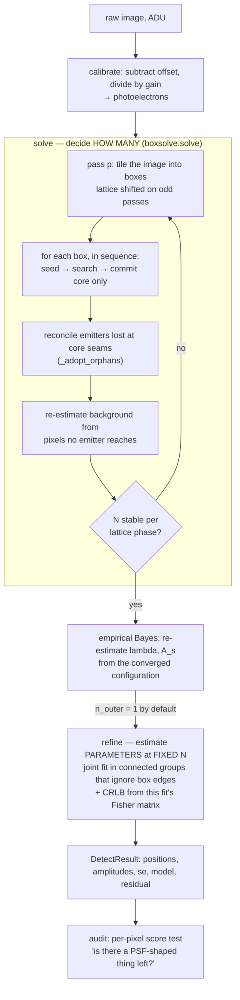
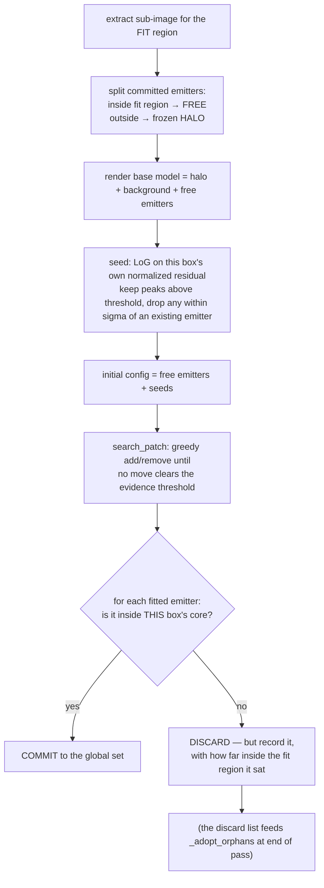
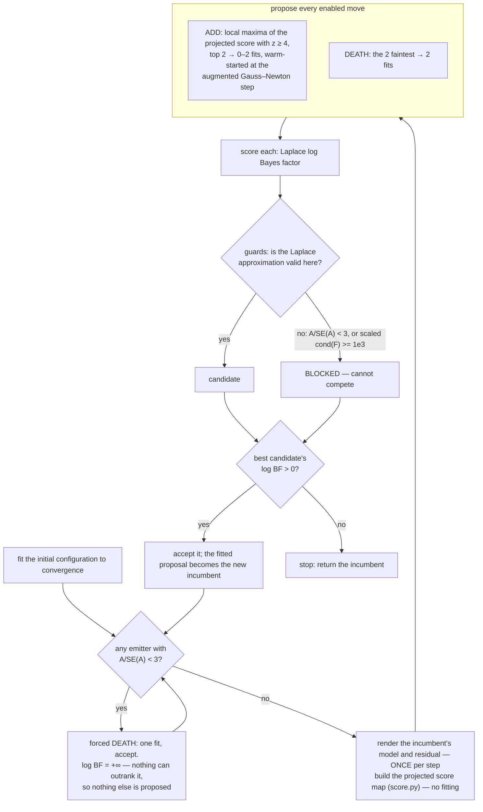

> **Superseded.** This documents `boxsolve`, the box-sequential solver. It is
> **not** the port target — see [`README.md`](README.md) for `gsolve`, which
> replaced it, and [`PORTING_NOTES.md`](PORTING_NOTES.md) for the practices the
> port needs.
>
> Kept because the reasoning is still load-bearing: sections 2 (units), 10 (the
> evidence), 11 (`lmga.fit`) and 14 (the acceptance test) describe layers
> `gsolve` uses unchanged. Everything about box tiling, core seams,
> `_adopt_orphans`, `score.py` and the BIRTH/DEATH/SPLIT/MERGE move loop
> describes machinery `gsolve` does not have. Do not port from this file.

# `boxsolve` — how the algorithm works

A plain-English walkthrough of the box-sequential spot detector, written so it can be read without the source in front of you, and so the Rust port has something to work from besides the Python.

This document describes **what the algorithm does and why**. The companion [`PORTING_NOTES.md`](PORTING_NOTES.md) records **implementation practices** — the traps that cost time here and should be designed out in Rust. The last section of this file, [Where the time actually goes](#where-the-time-actually-goes), is new material: measured profiles and the efficiency gaps they expose.

---

## Table of contents

1. [The problem](#1-the-problem)
2. [Units, and why they matter](#2-units-and-why-they-matter)
3. [The pipeline at a glance](#3-the-pipeline-at-a-glance)
4. [The statistical question](#4-the-statistical-question)
5. [Layer 1 — `detect_boxes`: the outer loop](#5-layer-1--detect_boxes-the-outer-loop)
6. [Layer 2 — `solve`: the pass loop](#6-layer-2--solve-the-pass-loop)
7. [Layer 3 — one box](#7-layer-3--one-box)
8. [The seam problem and `_adopt_orphans`](#8-the-seam-problem-and-_adopt_orphans)
9. [Layer 4 — `search_patch`: the greedy move loop](#9-layer-4--search_patch-the-greedy-move-loop)
9a. [`score.py` — where the next emitter goes](#9a-scorepy--where-the-next-emitter-goes)
10. [Layer 5 — the evidence](#10-layer-5--the-evidence)
11. [Layer 6 — `lmga.fit`: the bounded optimizer](#11-layer-6--lmgafit-the-bounded-optimizer)
12. [`refine` — the estimation half](#12-refine--the-estimation-half)
13. [How convergence is declared](#13-how-convergence-is-declared)
14. [The acceptance test](#14-the-acceptance-test)
15. [Where the time actually goes](#15-where-the-time-actually-goes)
16. [Efficiency gaps, ranked](#16-efficiency-gaps-ranked)
17. [Known open problems](#17-known-open-problems)
18. [Knob reference](#18-knob-reference)

---

## 1. The problem

Given one 2-D fluorescence image, find **how many** point emitters are in it and **where they are**, when emitters routinely overlap and the noise is Poisson.

The hard half is the count. Fitting `K` Gaussians once `K` is known is a solved problem. Deciding `K` is not, because:

- Adding an emitter always fits the data better, so you cannot pick `K` by goodness of fit.
- The usual test for "is one more emitter justified" — the likelihood-ratio test against χ²(3) — is **invalid** here. Under the null the extra emitter sits on the boundary of the parameter space (`A → 0`), and exactly there its position is unidentifiable: the likelihood is flat in two of the three added directions. Both of Wilks' regularity conditions fail.
- Worse, the LRT statistic is a *maximum* over the larger model's parameter space, so a better optimizer finds a larger one. Measured here on synthetic single-emitter fields, the false-positive rate at the nominal 5% cutoff moved from 3% to 10% purely by raising the optimizer's restart count from 4 to 25. **A test whose size depends on how hard you search cannot be fixed by choosing a different critical value.**

So the count decision is made with a **Laplace-approximated Bayes factor**, which integrates the added dimensions against a proper prior instead of maximizing over them. The prior's Occam factor charges for the search volume automatically, and the answer does not move when the optimizer gets better.

Everything else in the design follows from one further observation: *how* you decompose a big image into small fittable pieces determines whether the count decision converges at all. That is what the "box" in `boxsolve` is about, and section 6 is the heart of it.

---

## 2. Units, and why they matter

Everything downstream of `calibrate.py` works in **photoelectrons**:

```
d_e = (raw_adu - camera_offset) / gain
```

This is not cosmetic. The optimizer weights each pixel by `1/m` and every Fisher matrix in the pipeline is built from that weighting; the identity `Var = mean` that justifies it holds only in photoelectrons.

**The gain is a dispersion parameter, not a scale factor.** Three exact identities (verified numerically to machine precision):

- the I-divergence is homogeneous: `I(d/g, m/g) = I(d, m)/g`
- therefore **the fit does not depend on `g` at all** — fitted positions are invariant and amplitudes scale exactly as `1/g` (measured over `g = 1…50`: positions agree to 7e-7 px)
- the Fisher determinant picks up `log|F| = (1-K) log g + log|F_ADU|`

so the entire gain dependence of a birth/death decision collapses to

```
log BF(g) = dI_ADU / g + 1.5 log g + const
```

**Operational consequence:** changing the gain cannot change the fitted configuration. Its *only* effect is to move the detection threshold. This is why `refine_gain` is off by default — a residual-based gain estimator is a Pearson dispersion estimator, and dispersion estimators are inflated by lack of fit. When the model is wrong it raises `g`, which raises the threshold, which suppresses detections exactly where the model is already failing. A climbing `g` should be read as *a symptom of unmodelled structure*, not as a measurement.

Measure the gain once on the camera and pass it in. On the two bead frames here that is 4.23, confirmed independently twice over.

### The PSF model

```
m[i,j] = b + Σ_k A_k · Ey_k[i] · Ex_k[j]

Ey_k[i] = ½ ( erf((i - cy_k + ½)/(σ√2)) - erf((i - cy_k - ½)/(σ√2)) )
```

A **pixel-integrated** Gaussian, not a sampled one. `A_k` is **total flux**, so an observed peak height must be divided by `psf.peak_factor(σ)` (≈0.104 at σ=1.2) to become an `A`.

The model is **separable**: the two 1-D erf factors are the whole cost, and the outer products are cheap. Every performance decision in `psf.py` and `lmga.py` follows from this.

Parameter vector layout, everywhere in the codebase:

```
theta = [b, A_0, y_0, x_0, A_1, y_1, x_1, …]     length 3K+1
```

`b` is one background shared by the patch; positions are in **local** patch coordinates.

---

## 3. The pipeline at a glance



The single most important structural idea is the split between the two big boxes:

> **`solve` decides how many. `refine` decides where they are.**

They are deliberately *different fits*. A box's emitter is fitted against an artificial boundary the image does not have, and the box's background is a local nuisance parameter — fine for a count decision, wrong for a reported estimate. Once `N` is stable, `refine` re-fits everything at fixed `N` in groups that span box boundaries, and *that* fit's Fisher matrix is where the reported standard errors come from.

---

## 4. The statistical question

Every accept/reject decision in the pipeline answers one question: **does the evidence support `K+1` emitters over `K`?**

The generative model:

| quantity | prior |
|---|---|
| emitter count `K` | Poisson(`λ · Area`) |
| positions | uniform on the patch |
| amplitudes `A_k` | Exponential(mean `A_s`) |
| background `b` | Uniform[0, `b_max`] |

For a `K → K+1` move the `Area` factors cancel exactly (the prior odds contribute `λ·Area/(K+1)`, the new emitter's position prior contributes `1/Area`). What survives is area-free:

```
log BF = (I_K − I_{K+1})                    data term, in nats
       + log λ − log(K+1)                   prior odds on the count
       + Δ log π_A                          amplitude prior difference
       + (3/2) log(2π)                      Laplace volume, 3 new parameters
       − ½ ( log|F_{K+1}| − log|F_K| )      Occam factor
```

Both the exponential and uniform priors have zero curvature, so the Hessian of the negative log posterior *is* the Fisher information exactly — no extra terms.

Two subtleties that are easy to get wrong:

**The amplitude prior term is a difference over *all* emitters, not "the prior of the new one".** For a BIRTH total flux genuinely increases and it reduces to the familiar `−log A_s − A_new/A_s`. For a SPLIT the parent's flux is merely redistributed between two children, the flux difference vanishes, and the correct cost is just the `−log A_s` of carrying one more amplitude. Charging a split `A_child/A_s` as well over-penalizes — by ~1 nat at typical bead flux — precisely the move that resolves close pairs.

**Removal is the exact negation of addition.** `log_bf_remove` is `−log_bf_add` on the same pair of configurations. That antisymmetry is what stops the greedy search cycling between a move and its opposite: a DEATH cannot undo a BIRTH the search just accepted, because if the BIRTH scored `+x` the DEATH scores `−x`.

---

## 5. Layer 1 — `detect_boxes`: the outer loop

`boxsolve.detect_boxes` is the entry point. It:

1. Converts to photoelectrons using a **measured** gain if you pass one, otherwise `calibrate.estimate_gain` (a photon-transfer estimate from the dimmest 20% of pixels — see its docstring for two known failure modes; prefer a measured value).
2. Seeds `background` at the 10th percentile and `A_s` from the image max.
3. Runs `solve` — the box loop.
4. Re-estimates `λ = N/Area` and `A_s = mean(A)` from the converged configuration (empirical Bayes), and optionally the gain.
5. Runs `refine` at fixed `N`.

**`n_outer = 1`** — the outer loop runs once. It is *not* a substitute for convergence: `solve` reaches its own fixed point internally, and if it does not, that is a result to look at rather than something to iterate past. Measured, with gain pinned, the empirical-Bayes estimates are already at their fixed point after the first pass (FOV2: λ 0.0328 then 0.0328; `A_s` 945.5 then 945.6) and a second outer pass reproduces the result exactly at twice the runtime:

| frame | n_outer | N | audit | z range | time |
|---|---|---|---|---|---|
| FOV1 | 2 | 68 | 3 missed / 0 piled | −5.0 … +26.6 | 89.8 s |
| FOV1 | 1 | 68 | 3 missed / 0 piled | −5.0 … +26.6 | 44.9 s |
| FOV2 | 2 | 126 | 6 missed / 3 piled | −13.0 … +43.4 | 143.4 s |
| FOV2 | 1 | 126 | 6 missed / 3 piled | −13.0 … +43.4 | 70.8 s |

Raise it only if you are *not* pinning the gain.

---

## 6. Layer 2 — `solve`: the pass loop

This is the part that makes the whole thing work, and it is worth understanding what it replaced.

### What went wrong before

The previous design grouped emitters into patches by **connected components of the current emitter set**. That makes the decomposition a function of the answer: accept one move and every group is redrawn, so every quantity computed inside a group — Fisher matrices, standard errors, the guards built on them — changes with the redrawing rather than with the data.

The measured consequence on `beads_60x_still.tif` was total:

- 0 of 192 sweeps accepted nothing
- 0 of 16 rounds reached a fixed point
- `N` oscillated with period 2 between **65 and 118** for the entire run
- 2710 of 2725 accepted deaths were forced by the `A/SE(A) ≥ 3` guard failing

That guard reads **20.6** for a pair of bright emitters 1.5 px apart when the neighbour is frozen in the halo, and **3.5** when the same neighbour is free in the same group. The same physical pair is "resolved" on one sweep and "unresolved" on the next. That is not a tuning problem; it is a fixed-point problem with no fixed point.

### The fix: decompose the *image*, not the model

`boxes.tile` cuts the image into a fixed lattice. Each box has two regions:

```
   ┌──────────────────────────────────┐  ← box / FIT region (core + pad, clipped at image edge)
   │  pad ring — visible, never committed
   │   ┌──────────────────────┐       │
   │   │                      │       │
   │   │   CORE — this box    │       │   cores PARTITION the image exactly
   │   │   owns these pixels  │       │   pad = 3σ on every side (default)
   │   │                      │       │   core = 6σ  (default)
   │   └──────────────────────┘       │
   │                                  │
   └──────────────────────────────────┘
```

Three rules make each box's answer its own:

**Rule 1 — a box sees its whole fit region and may place emitters anywhere in it.** It has to be allowed to. Flux from a neighbour just outside the core lands on the core's pixels, and a model that cannot represent that neighbour will explain its flux with a *spurious core emitter* instead.

**Rule 2 — a box commits only the emitters inside its core.** Cores partition the image, so every emitter has at most one owner. An emitter the box placed in the pad ring is truncated by an artificial boundary — one sitting on the box edge loses half its support — so this box is not entitled to an opinion about it. It is discarded, and the box that owns that ring decides for itself with a truncation-free view.

**Rule 3 — the box's residual is built from scratch.** Committed emitters inside the fit region are re-fit as free parameters (initialized from their committed values); committed emitters *outside* it contribute a frozen halo. Nothing carries over from the previous box's arithmetic.

Boxes are visited **in sequence**, and each sees what the previous ones committed (Gauss–Seidel), not a frozen snapshot (Jacobi). That is the other half of why this converges: under Jacobi, two boxes could both claim the same flux in the same pass and both be surprised in the next one.

### Why `pad = 3σ`

`pad` is what buys the core a truncation-free view. A core emitter sits at least `pad` px inside the box on every side, so the fraction of its flux the box contains is `erf((pad+½)/(σ√2))²`:

| pad/σ | px at σ=1.2 | flux seen |
|---|---|---|
| 2.0 | 2.4 | 0.9905 |
| 2.5 | 3.0 | 0.9970 |
| **3.0** | **3.6** | **0.9996** |
| 4.0 | 4.8 | 0.99999 |

At 4 parts in 10⁴ the truncation is far below the Poisson noise on anything detectable.

### Why `core = 6σ` — this one is counter-intuitive

`core` looks like a pure cost knob: the joint fit is O(K³) in the box's free emitter count, so a big core in a dense field should be expensive. It is **also an accuracy knob, and that dominates.** Every core boundary is a place where the count decision is made twice, from two different data windows, and the two answers need not agree. Fewer seams means fewer such places. Measured on FOV1:

| core | pad | box | N | time | audit | z range | z sd |
|---|---|---|---|---|---|---|---|
| 5 | 4 | 13×13 | 66 | 65 s | 7 missed / 4 piled | −8.4 … +62.8 | 1.73 |
| 5 | 6 | 17×17 | 67 | 110 s | 5 missed / 4 piled | −5.6 … +63.1 | 1.45 |
| **7** | **4** | **15×15** | **68** | **45 s** | **3 missed / 0 piled** | **−5.0 … +26.6** | **1.27** |
| 7 | 6 | 19×19 | 66 | 90 s | 3 missed / 3 piled | −5.3 … +63.1 | 1.37 |
| 9 | 6 | 21×21 | 68 | 43 s | 2 missed / 1 piled | −5.0 … +26.6 | 1.20 |

Widening the **pad** alone does not buy this — (5,6) is a 17×17 box and is still worse than (7,4) at 15×15 — so it is the seam count that matters, not the amount of context. Fewer, larger boxes are also **faster**, because per-box overhead (seeding, halo rendering, the first fit) is paid once per box regardless of size.

Raising `core` further is worth trying on denser data; the joint fit is the eventual limit, and `k_max` should rise with it.

### Jitter: moving the seams between passes

A box boundary that falls between two overlapping emitters puts them in different cores, and neither box ever sees the pair whole. On odd passes the core lattice is shifted by `core//2` so that seam is somewhere else, and a pair one pass could not fit jointly gets a pass where it can.

**The shift must be applied to the boundaries themselves, not to the range they are spread over.** Re-running `linspace` from `−shift` with the same piece count merely re-spaces the same interval, and integer rounding snaps the later boundaries back onto the unshifted ones. Measured on the 39×39 frame at core=5, that left y = 24, 29, 34 as seams in *both* phases:

```
phase 0    0   5  10  15  20  24  29  34  39
phase 1    0   3   8  13  18  24  29  34  39     ← last four identical
```

so a pair straddling y=34 was never fitted jointly by any box in any pass. It showed up as the one strong interior defect on the frame: emitters at (33.30, 26.06) and (33.57, 24.62), the second 0.43 px from the seam, with an over-modelled `z = −12.5` beside an unexplained `z = +27.1` across the boundary. Cropping the same region made the rounding land elsewhere, the seam moved, and the pair came out clean — **which is why the region looked solvable in isolation and was not solvable in place.** A good reminder when debugging with `--crop`.

### The background

Re-estimated once per pass from **the pixels no emitter reaches** (`robust_background`), not from the median of the boxes' fitted `b`. A box in a dense region has no emitter-free pixels, and its `b` has absorbed whatever the model failed to explain.

Neither half of `robust_background` can be skipped: the plain image median is not a background estimate for a crowded field (99 ADU against a true 12–19 on FOV1), but a fixed low quantile is not one either (the 10th percentile reads 9.7 against a true 20 on a sparse frame). Masking each emitter's support and taking the median of the rest is right in both regimes, and reduces to the plain median when there are no emitters.

---

## 7. Layer 3 — one box



### Seeding

The search's BIRTH move would eventually find every emitter one at a time, each costing a full fit and a full proposal round. Seeding hands the search a configuration that is already roughly right and leaves BIRTH to mop up what seeding missed — which is what BIRTH is good at.

The seeder computes the **normalized residual** `(sub − base)/√base`, applies a Laplacian-of-Gaussian filter, and keeps local maxima above `LOG_SEED_THRESHOLD = 1.5`.

That constant is calibrated against pure-Poisson-noise images: the LoG-filtered normalized-residual noise floor has mean ~0.88, p99 ~1.13. 1.5 sits just above it with margin while staying loose — **recall matters here, not precision**, because the Bayes factor does the actual pruning. The threshold is valid *only* on the LoG-filtered normalized residual; the unfiltered one exceeds 1.5 essentially always, even under a perfect model.

### The commit rule, precisely

Pixel `i` covers `[i−0.5, i+0.5)`, so a core spanning pixel indices `[c0, c1)` owns the continuous region `[c0−0.5, c1−0.5)`. Written that way the cores partition the plane with no gap and no overlap: an emitter exactly on a boundary goes to the higher box, and to exactly one of them.

### Image-border slack (`out_margin`, off by default)

At the image border there is no neighbouring box to own the outside, so a box *may* be allowed to place emitters past the frame. This is **off by default, on measurement rather than on principle.**

The principle says it should help: flux from a bead centred outside the frame is real, it lands on the rim pixels, and with positions clamped to the data the only way to explain it is to rail an emitter at the bound (traced: `x = 15.50` against a bound of 15.5), where the Laplace evidence is not valid and the search kills and re-creates it on alternate passes. Letting the centre leave the frame does fix that locally — on a 16×16 crop it took the over-modelled rim peaks from 6 to 2.

Globally it is a clear loss, because an emitter outside the frame lies in no core and is therefore **never committed**. A rim bead whose true centre is at y = +0.2 gets fitted to y = −0.6 often enough that it is thrown away with its flux, and the model ends up explaining *less* of the rim than before:

| out_margin | N | audit (whole frame) | z sd | converged |
|---|---|---|---|---|
| 0 px | 67 | 7 missed / 3 piled | 1.80 | yes, 13 passes |
| 4 px | 57 | 13 missed / 8 piled | 3.77 | no, N cycles 57↔60 |

Pass a non-zero value only when the image is a **crop** of a larger field, where the region outside really is full of emitters and none of the rim detections were trustworthy anyway.

---

## 8. The seam problem and `_adopt_orphans`

This is the subtlest bug in the codebase and worth its own section.

The claim "cores partition the image, so every emitter has exactly one owner" is **false**. The partition is a statement about *points*. The commit rule is applied to *estimates of a point*, and the two boxes sharing a seam estimate that position from different data — different window, different halo, different free neighbours. They routinely disagree by ~0.1 px.

An emitter that close to a seam is placed on the far side of it by **both** boxes; each concludes it belongs to the other; both discard it:

```
box A, core x ∈ [12.5, 19.5)   fitted the emitter at x = 19.53   → discarded
box B, core x ∈ [19.5, 25.5)   fitted the same one at x = 19.45  → discarded
```

The invariant that actually holds is **at most one owner** — no double counting, no guarantee against loss.

**Widening the ownership test by an epsilon does not fix it.** Whatever boundary the test uses, it is still compared against two different estimates, so the crack just moves to the new boundary.

The repair is a **reconciliation at the end of the pass**. Every discarded emitter is recorded (position, amplitude, which box, and how far inside that box's fit region it sat). At end of pass, near-duplicates are grouped by single-link at `σ`, and a group is adopted only when:

1. **No committed emitter is within `σ` of it** — if the owning box committed one there, nothing was lost.
2. **At least two *different* boxes fitted it.** A box's pad ring is truncated and can hold spurious emitters, and the box that owns that ground had a truncation-free view and is entitled to say there is nothing there. Mutual agreement between neighbours is what separates "each thought it was the other's" from "one of them was wrong".

The estimate kept is the one from the box that saw it with the largest **view margin** — the least truncated view.

**Cost of the bug:** one bright bead per frame. On FOV1, an `A = 987` bead at (34.1, 19.5) — the whole of that frame's remaining interior residual, a score-test peak of `z = +70` before `refine`, which `refine` then smeared into four positive and one negative audit finding by dragging surrounding emitters up to 5 px at fixed `N`, one of them onto its patch bound. FOV2 lost an `A = 1386` bead the same way. Closing the gap took FOV1 to a **clean** audit.

**Why it appeared when it did** — and this is the general lesson: the defect is as old as the box solver, but it was invisible while `lmga.fit` stalled every fit near its integer seed. Seeds sit on pixel centres, which are never within 0.1 px of a seam. Fixing the optimizer let positions actually move, and the first thing they did was straddle a seam. **Expect a class of latent bugs to surface the first time a solver in a pipeline starts genuinely converging.**

---

## 9. Layer 4 — `search_patch`: the greedy move loop

Given one box's data, an initial configuration, and the priors, find the best-supported emitter count.



### Why "best move" and not "first acceptable move"

Taking the single best move is what makes the loop terminate. Log-evidence increases strictly on every accepted step, so no configuration can ever repeat.

### The moves

**ADD** — one emitter at a local maximum of the **projected score map** (`score.py`, section 9a below). This one move replaces both SPLIT and BIRTH.

**DEATH** — rank by amplitude, test the faintest few. This is a **proposal ordering, not a significance screen**; whichever emitters are proposed still face the full Bayes factor. (The screen it replaced, `A/SE_A < 5`, was a frequentist test smuggled in beside the Bayes factor.)

There is one exception. An emitter whose amplitude is not resolved from the `A ≥ 0` boundary makes the **current** configuration's evidence unusable, by the same argument that blocks a proposal from creating one. Such an emitter is always removed, and that is not a judgement call — the evidence for keeping it cannot be computed, so it yields `log BF = +∞`.

Because `+∞` cannot be outranked and the search takes the single best move, **a step containing a forced removal need not propose anything else at all.** `msearch._forced_removal` detects that case and short-circuits, reproducing exactly the emitter the full round would have chosen. Verified bit-identical on both bead frames; measured, the proposals it skips were ~27% of all LM iterations.

**Retired: SPLIT, BIRTH, MERGE.** All three are still correct and still reachable (`MOVES_LEGACY`, `MOVES_WITH_MERGE`); they are how the ADD move was measured. MERGE was retired first, on the argument that `log_bf_remove` is the exact negation of `log_bf_add` (819 proposals, 0 accepted, never within 2 nats). SPLIT and BIRTH were retired by section 9a.

---

## 9a. `score.py` — where the next emitter goes

This is the change that made the search cheap, and the reasoning generalizes well beyond this pipeline.

### The problem it solves

Measured on `beads_60x_still.tif` under the old proposals: **80% of all add proposals were fitted to convergence and then discarded**, every one of them because the added emitter's `A/SE(A)` came out below 3. Each cost ~65 LM iterations, and 52% of split proposals exhausted the 100-iteration cap.

The obvious idea — screen with `audit.score_map`'s `z` at the proposed site — **does not work**, and the reason is instructive. Measured over 1581 proposals, the post-fit `A/SE` exceeded the site's `z` in 79% of cases, by up to 28; accepted proposals had site-`z` as low as 0.01. That is not a defect of the statistic, it is a verdict on the proposals: `z` at the site was measuring a *bad guess*, and the fit was doing the actual searching.

### The statistic

Linearize about the incumbent: design `J = d(model)/dθ`, weights `W = diag(1/m)`, residual `r = d − m`. Adding a unit-flux PSF `g` at `(y, x)` appends one column, and the ML amplitude of that column **with every existing parameter free** is the coefficient on the part of `g` the current model cannot already produce:

```
g_⊥ = g − J F⁻¹ Jᵀ W g                    F = Jᵀ W J

with u = Jᵀ W g   and   q = Jᵀ W r  ( = −grad, zero at a converged fit ):

    den = gᵀWg − uᵀ F⁻¹ u        ← 1 / Var(A_new), MARGINAL
    num = rᵀWg − uᵀ F⁻¹ q
    z   = num / √den
```

`den` is the Schur complement of the new amplitude against the whole incumbent model. **Marginal, not conditional** — it already charges for the flux a neighbour could have absorbed instead, which is exactly what makes it comparable to the post-fit `A/SE(A)` rather than merely correlated with it.

### Why this replaces both BIRTH and SPLIT

The projection is what makes one move do the work of two. Near an existing emitter, `g` is largely reproducible by that emitter's own amplitude and position columns; the projection removes precisely that part, and what survives is the residual quadrupole an unresolved pair leaves behind. So:

- a peak of `z` **on top of an emitter** is the SPLIT proposal — found from the data, not from a fixed displacement along an eigenvector;
- a peak **in open ground** is the BIRTH proposal.

The two moves differed only in how they guessed. They never differed in what they claimed. And `evidence.log_bf_add` needs no change to accept either, because it takes the amplitude-prior term from the *actual* flux difference: a genuine birth raises total flux and is charged `A_new/A_s`, a split redistributes it and is not.

### The warm start comes free

The same solve gives the whole linearized step. The augmented Gauss–Newton system at the incumbent (existing gradient zero, `A_new` starting at zero) is

```
[ F    u ] [ δθ    ]   [   0   ]
[ uᵀ   c ] [ A_new ] = [ rᵀWg  ]
```

whose solution is `A_new = Â` and `δθ = −Â · F⁻¹u` — the existing emitters' rebalancing, and `F⁻¹u` was already formed for `den`. So the proposal starts at the joint linearized optimum instead of at a guess. **This is what took the cap rate from 37.2% to 5.0%**, and it is the direct answer to what was open problem #3.

### As a screen, `z` is a bound with margin

`z` is the linearized `A/SE(A)` of the emitter the proposal would create, and `RESOLVED_TAU = 3` blocks anything below 3 — so a site below that cannot produce a proposal the guard would let through. Measured against the old proposals' outcomes:

| `z_add_min` | proposals skipped | LM iters skipped | unblocked killed | accepted killed |
|---|---|---|---|---|
| 2.5 | 5.7% | 7 380 | 0 | 0 |
| 3.0 | 15.2% | 19 997 | 0 | 0 |
| **4.0** | **37.0%** | **46 886** | **0** | **0** |
| 5.0 | 54.4% | 69 833 | 2 | 0 |
| 6.0 | 68.4% | 81 527 | 7 | 5 |

The post-fit `A/SE` exceeded the pre-fit `z` in 25 of 1581 cases (1.6%), median gap −3.8, and the **lowest `z` at which any proposal was ever accepted was 5.60**. So 4.0 sits a full 1.6 below the observed floor. It is a bound with margin, not a tuned threshold — and the table shows exactly where it stops being one.

### Cost

Four small matmuls and one `p×p` solve, vectorized over candidate positions because the PSF is separable: with `Ey (h×ny)` and `Ex (w×nx)`, `rᵀWg` at every position is `Eyᵀ (r∘W) Ex`, and likewise for `gᵀWg` and each column of `u`. On a 15×15 box at `K=16` that is ~2 Mflop per search step, against ~0.5 Mflop for **one** LM iteration of a fit that would have run for 65 of them. It does not appear in the top 20 of the profile.

### One thing it cannot do: seeding

Seeding from this same statistic — so that seeds and proposals use one mechanism — was tried and is **much worse**, for a reason worth carrying forward: *one score map places one emitter.* The map is a statement about adding a single emitter to the current model, so reading several peaks off it at once double-counts every neighbourhood where two peaks compete for the same flux. At `z ≥ 4.0`: 618 seeds against the LoG seeder's 140, and 391 735 LM iterations against 35 031 (31.2 s against 2.8 s) for the same audit — the surplus all pruned again by DEATH. A LoG filter has no such problem because it never claims to be a fit. Raising `LOG_SEED_THRESHOLD` does not help either (2.5 gives 134 seeds and slightly *more* work).

**MERGE** — disabled by default, on both an argument and a measurement.

The argument: `log_bf_remove` is the exact negation of `log_bf_add`, and the search only ever accepts a SPLIT whose log BF > 0, so merging that pair back on the very configuration the split produced has log BF < 0 **by construction**. MERGE can only fire on a configuration inherited from an earlier pass whose `(λ, A_s, background)` have since moved — a narrow window.

The measurement, over a full FOV2 run:

| move | proposed | accepted | blocked | max log BF |
|---|---|---|---|---|
| split | 1844 | 56 | 1605 | +512.47 |
| birth | 466 | 46 | 367 | +512.56 |
| death | 932 | 34 | 0 | −0.20 |
| **merge** | **819** | **0** | **0** | **−2.14** |

819 fits, no acceptance, never within 2 nats of one — a fifth of total work. Dropping it left both frames bit-identical. The move itself is correct and is kept; pass `enable=MOVES_WITH_MERGE` to a search that might inherit an over-split configuration.

---

## 10. Layer 5 — the evidence

`evidence.py` computes the Laplace Bayes factor and, critically, decides **when it is not allowed to**. There are two guards, and both are validity conditions on the approximation rather than significance tests. Both **block** a move rather than being weighed against it.

### Guard 1 — the conditioning guard (`COND_GUARD = 1e3`)

On the **diagonally scaled** condition number of `F`. The raw `cond(F)` is useless as an absolute test because `F` mixes parameters with different units — background in counts, amplitude in total flux, position in pixels. Measured at σ=1.2: a pristine isolated emitter reads 8.4e6 raw but **1.6 scaled**; a genuinely degenerate pair at 0.5σ reads 1.3e11 raw and **1.8e4 scaled**. No fixed raw threshold separates them; the scaled form does, and is invariant to reparameterization.

### Guard 2 — amplitude resolution (`RESOLVED_TAU = 3.0`)

Every emitter's amplitude must be at least 3 standard errors clear of the `A ≥ 0` boundary.

The Laplace form integrates the added dimensions against an *unbounded* Gaussian of width `SE(A)`, but the true posterior is truncated at `A ≥ 0`. When the mode sits less than a few SE from that boundary the Gaussian spills across it and the posterior volume — hence the evidence — is overstated.

**The overstatement is not a bounded nuisance; it diverges.** The added emitter's 3×3 block of `F` has `F_AA = O(1)` but `F_yy, F_xx ∝ A²`, so `|F| ~ A⁴` and the Laplace volume `|F|^{−1/2} ~ A^{−2}`. Holding a second emitter at fixed amplitude and shrinking it:

| A₂ | dI | −½ Δlog\|F\| | log BF for adding it |
|---|---|---|---|
| 30.0 | 3.771 | 2.042 | −2.77 |
| 3.0 | 0.727 | 6.237 | −1.60 |
| 1.0 | 0.045 | 10.302 | **+1.78** |
| 0.1 | 0.025 | 13.191 | **+4.65** |
| 0.01 | 0.003 | 17.699 | **+9.14** |

`dI` goes to zero — the emitter explains nothing — while the Occam term, whose *whole job* is to charge for complexity, **pays about 4.5 nats per decade for making it fainter**. Any greedy search with an honest optimizer will walk straight into that.

Calibrated against exact 4-D numerical integration of the same posterior, the approximation is trustworthy from about 3 SE outward (mean signed error −0.26 in the 3–4 bin, −0.74 in 2–3, −0.80 in 1–2) — which is also where a Gaussian keeps under 0.2% of its mass on the wrong side of the boundary. Hence 3.0.

### Where the amplitude floor lives, and why it cannot live in `evidence`

An emitter whose amplitude has collapsed to its lower bound has a position block of `F` scaling as `A²`, which underflows and makes `log|F|` meaningless. You might want to catch that in `logdet_cond`. **You cannot.** No test on `F` alone can separate an uninformed parameter from a perfectly well-posed matrix expressed in badly chosen units — both produce the same signature (huge raw cond, small scaled cond). A relative-diagonal floor added there was reverted for exactly that reason: it rejected a valid `F` rescaled by `diag(exp(U(−8,8)))`, which is the reparameterization invariance the function exists to provide.

So the pathology is prevented **at its source, where the flux scale is known**: `msearch._bounds` floors the amplitude at `1e-6 × A_max` — relative to the patch, not absolute. Measured ratio of smallest to largest `diag(F)` with a second emitter parked at the floor:

| floor / A_max | min/max diag(F) |
|---|---|
| 0 (1e-4 absolute) | 3.0e-14 ← float64 noise |
| **1e-6** | **6.4e-10** |
| 1e-4 | 4.8e-07 (saturates) |

**General principle worth carrying into Rust:** numerical guards belong where the physical scale is known, not in the linear-algebra layer. Pass scale context down rather than writing clever scale-free guards deep in the stack.

---

## 11. Layer 6 — `lmga.fit`: the bounded optimizer

Bounded Levenberg–Marquardt with Coleman–Li affine scaling, minimizing the **Poisson I-divergence**:

```
I(d, m) = Σ_i [ d_i log(d_i/m_i) − (d_i − m_i) ]      (0·log 0 := 0)
```

by Fisher scoring: `W = diag(1/m)` held fixed within an iteration, so the normal-equations matrix `F = JᵀWJ` is the **expected** Fisher information — exact for Poisson's canonical link, where Fisher scoring coincides with IRLS.

### Strict interiority is an invariant, not a convention

Coleman–Li defines `v_i` = distance from parameter `i` to whichever bound its step is heading toward, and divides by it. A parameter sitting *exactly* on its bound sets `v_i = 0`.

The failure is **not local to that parameter**. The fraction-to-boundary rule computes one scalar step scale from `min_i (bound_i − θ_i)/δ_i`, so a single stuck coordinate collapses the step for *every* coordinate. The step then buys ~1e-11 nats, its gain ratio reads ~2e-8 — which is measuring the clip, not the quality of the quadratic model — so the step is rejected, λ is multiplied by ν, and ν doubles. λ ratchets away and the fit spends its whole budget on micro-steps.

Measured on FOV1 when the code ended each accepted step with `θ = clip(θ+δ, lo, hi)`:

- **68.6%** of LM iterations began with a parameter exactly on a bound (always a *position*, railed at a box edge)
- 46.5% of inner trials were clipped; 92% of those collapsed to the `1e-8` floor
- **73.2%** of all fits burned their entire 100-iteration budget with λ at ~1e4 and `max|grad|` still ~13

Replacing the clip with `_to_interior` (pull strictly inside by a fraction of each bound's own range): fits reaching a convergence test rose from 24% to 64%, the frame solved **2.5× faster**, and `N` stopped depending on the lattice phase.

The margin must be **relative** to each bound's range. A position is bounded over ~20 px and an amplitude over ~1e4 e⁻; one absolute epsilon is a different constraint for each.

> In Rust: make this unrepresentable with an `Interior` newtype whose constructor is the only way in. The Python version *documented* the invariant in its module docstring and still violated it in the body for months.

### The two damping diagonals must be consistent

The Coleman–Li system is

```
( F + diag(|grad|/s²) + λ·diag(1/s²) ) δ = −grad ,   s = √v
```

The scaled-space system is `(D F D + diag(|grad|) + λI) ŝ = −D·grad` with `D = diag(s)`. Mapping back to the unscaled step `δ = D ŝ` sends **both** extra diagonals through `D⁻¹(·)D⁻¹`, so both pick up `1/s²` — not `1/s` for one and `1/s²` for the other, which is what this used to do. The mismatched version under-damps every parameter approaching a bound (at `v = 0.01` it applies `10|g|` where the correct term is `100|g|`).

Over 200 randomized 1–3 emitter fits, the consistent form reaches a lower converged I-divergence 6 times to 1 with 193 ties, is better by **3.5 nats on average** — a large error on the scale a log Bayes factor is decided on — and gets there in 10.9 iterations against 20.4.

The term must stay positive semi-definite; a signed version subtracts curvature wherever `grad < 0` and can make the matrix indefinite.

### λ must be driven by the gain ratio

Accepting *any* decrease and halving λ for it lets λ collapse to its floor while the quadratic model is worthless, and then nothing damps the near-null directions of `F`. Traced on a real patch (K=7, 15×14, one emitter parked at the amplitude floor so its position block of `F` reads 5.7e-12 and `cond(F) = 1.5e20`): every iteration predicted a decrease of 5.2e4 nats, delivered 1.05e-3, halved λ anyway, and took the identical 2.3e-5 step again. It crawled for 3000+ iterations and finished **364 nats above the optimum**.

With the LM gain ratio `ρ = actual/predicted` in charge, `ρ = 2e-8` *raises* λ instead, which regularizes exactly that direction. λ then decreases by Nielsen's smooth rule — aggressive for a trustworthy step, gentle for a marginal one.

### Convergence tolerances in decision units

The **primary** stopping test is on the *predicted decrease in `I`, in nats* (`−½ grad·δ`), because everything downstream compares I-divergences on the scale of a log Bayes factor. "This fit cannot improve `I` by more than 1e-8 nats" is a statement about the decision, not about the parameterization.

Gradient- and step-norm tests are kept as backstops but cannot be primary: both are **absolute**, and the natural scale here is set by fluxes running to ~2000 e⁻, so `1e-6` and `1e-10` are near float64 noise. Before this was added, 34.5% of 9400 patch fits exhausted `max_iter = 100` without satisfying either.

**The attached trap, and it is important:** a proposal fit starts *further from its optimum* than the incumbent it is compared against. Truncating iterations therefore does not add symmetric noise — it systematically leaves the *proposal's* `I` too high and **biases model selection toward the smaller model**. Measured: capping at 40 iterations still left 21% of fits more than 0.1 nat above their optimum, p99 gap 72 nats. Resist capping `max_iter` for speed; make each iteration cheaper instead.

> **Naming hazard for the port.** `solve(max_iter=40)` is the *search step* budget passed to `search_patch`; `lmga.fit(max_iter=100)` is the *LM iteration* budget. They are unrelated and a reader who conflates them will "optimize" the wrong one, straight into the bias above. In Rust call them `max_search_steps` and `max_lm_iters`.

### Geodesic acceleration: implemented, measured, removed

It changed the converged objective by under 1e-13 on ordinary fits and by 0.007 on the hardest close-pair fits at 0.5σ separation (below the identifiability limit anyway), while costing 133 model/Jacobian evaluations per fit instead of 18 — 94 ms against 0.7 ms. The curvature term needs a nested jvp per inner λ trial, which dominates everything else on 81-pixel patches.

---

## 12. `refine` — the estimation half

Once `N` is settled, `refine` does a completely different fit:

- Groups are **connected components of the committed emitter set** (`patches.py`), so a pair that a box boundary separated is fitted jointly at last.
- **No move is proposed**, so nothing here can change the answer to "how many". This is what makes the unstable-grouping problem from section 6 harmless: instability only matters when the grouping feeds back into a model-selection decision.
- Standard errors come from the Fisher matrix of **this** fit — the one whose parameters are actually reported — as `SE = √diag(F⁻¹)`, i.e. the CRLB at the fitted point.

Emitters just outside a group, within `halo_radius_factor = 5σ`, are frozen and folded in as a constant. That radius is not arbitrary: an emitter neither free nor frozen is, from the patch's point of view, *not in the model at all*, and the patch's free `b` is the only parameter that can absorb it. Worst-case leak into a patch from emitters outside its halo:

| halo/σ | max leak | p99 leak | frozen emitters/patch |
|---|---|---|---|
| 3.0 | 3.10 | 2.40 | 2.8 |
| 4.0 | 0.155 | 0.086 | 3.7 |
| **5.0** | **0.001** | **0.001** | **4.6** |

At 3.0 a patch could be handed an unmodelled pedestal of 3.1 e⁻ on a 4 e⁻ background. With the halo removed entirely, `b` is driven to 57 e⁻ and precision/recall fall from 1.00/0.75 to 0.62/0.62. Frozen emitters cost one rendered constant each and do not enter the Hessian.

---

## 13. How convergence is declared

**On `N` alone, held for `n_stable = 2` passes of the same lattice phase.**

Positions are deliberately *not* part of the test. `jitter` moves the core lattice between passes, so consecutive passes fit each emitter against a different box boundary; a sub-pixel wobble of 0.1–0.4 px between them is the expected behaviour of a correct solver, not a failure to converge. What must stop moving is the **count** — that is the question the boxes are answering. Parameters are settled afterwards by `refine`.

Convergence is checked **per lattice phase** (stride 2 when jitter is on). Asking for `N` to hold over *consecutive* passes cannot succeed while jitter is on — measured on both bead frames it never once fired, and the loop ran the full `n_passes` every time, printing a warning about a two-cycle that is expected behaviour:

```
FOV1   [65, 67, 65, 68, 65, 68, 65, 68]
FOV2   [128, 125, 127, 126, 127, 126, 127, 126]
```

Both are converged by pass 6 in the only sense available: **each phase has stopped changing.** Comparing same-phase passes detects that, and reduces to the old consecutive test when jitter is off.

> ⚠️ The count returned is the one belonging to the phase the loop happens to stop on (68 not 65; 126 not 127). The phases disagree about emitters near a seam and each is right about different ones. **That disagreement is a real open problem** — see section 17 — not something the stopping rule decides.

---

## 14. The acceptance test

**Judge results by `audit.py`, not by `N` and not by residual spread.**

The audit asks the outside question: after the search has finished, does the residual still contain point-like structure? A missed emitter leaves a **positive** PSF-shaped residual; a model that has piled two PSFs onto one real emitter, or inflated a patch background, leaves a **negative** one. Both are invisible in a summary statistic like the robust spread, which averages them against each other and against the noise.

At each pixel, the ML amplitude of a unit-flux PSF added there and its variance are exact:

```
z = Σ_i (r_i g_i / m_i) / √( Σ_i g_i² / m_i )
```

which is `Â` in units of its own standard error — the **score (Rao) test** for adding one emitter. That is why it is the right screen to pair with the Bayes factor rather than a substitute for it: it costs one correlation per image instead of a fit per candidate, and it is evaluated at the *current* model, so it answers "did the search stop too early or too eagerly" without re-running the search.

Under a correct model `z` is asymptotically standard normal, but with **heavier tails than Gaussian** because Poisson counts at these rates are skewed: `|z| > 5` occurs at 7.6e-5 per pixel against the normal 5.7e-7. So the threshold is calibrated by measurement, not from a normal table. At the default 5.0, a correct model produces about **one spurious finding per five images**.

---

## 15. Where the time actually goes

Measured on `beads_60x_still.tif` (39×39), σ=1.2, gain pinned at 4.23. **Both columns are the same code**; the left is `enable=MOVES_LEGACY`, the right the default `MOVES_ALL`.

| | legacy SPLIT+BIRTH | ADD (default) |
|---|---|---|
| wall time, FOV1 | 9.5 s | **2.4 s** |
| wall time, FOV2 (62×62) | 21.8 s | **3.6 s** |
| proposal fits | 2 238 | **1 088** |
| LM iterations | 125 273 | **34 441** |
| fits at the 100-iteration cap | 37.2% | **5.0%** |
| mean iterations per add fit | 65.2 | **28.5** |

**~99% of wall time is inside `search_patch`**, and inside that, essentially all of it is `lmga.fit`.

### Where it goes now, by role

| fit role | count | % of LM iterations | mean iterations | at the cap |
|---|---|---|---|---|
| initial (per box) | 264 | 20.8% | 27.2 | 19 |
| add proposal | 305 | 25.3% | 28.5 | 6 |
| **death proposal** | **594** | **53.9%** | 31.3 | 15 |

### The correction that matters most for the port

The earlier version of this section ranked "redundant linear algebra" high. **Measured, it is not.** `cProfile` on the legacy path, 10.9 s total:

| | cumulative | share |
|---|---|---|
| `lmga.fit` | 10.40 s | **95%** |
| — of which `psf._factors` (erf/exp) | 2.88 s | 26% |
| — of which `psf.model_and_jac_ax` | 2.13 s | 20% |
| `evidence.logdet_cond` (4346 calls) | 0.24 s | 2.2% |
| `np.linalg.cond`'s SVDs | 0.11 s | 1.0% |
| `moves.residual_axis` | 0.06 s | 0.6% |
| `np.linalg.inv` | 0.03 s | 0.3% |

The `p ≈ 25` matrices are simply too small for their factorizations to matter beside a Jacobian evaluated 181 330 times. **The only lever that moved the needle was fewer and better-started fits.** The linear-algebra cleanups were done anyway — they are exact and they cost nothing — but they are worth ~4%, not the 40% the ranking implied. In Rust, where the fits get 20–50× faster, they become a real fraction again; that is the reason to keep them, not the Python profile.

### Per pass

| pass | lattice | boxes | boxes accepting **no** move | fits | time (s) |
|---|---|---|---|---|---|
| 0 | phase 0 | 36 | 8 | 801 | 2.14 |
| 1 | phase 1 | 49 | 27 | 604 | 2.79 |
| 2 | phase 0 | 36 | **35** | 287 | 1.29 |
| 3 | phase 1 | 49 | **40** | 465 | 1.87 |
| 4 | phase 0 | 36 | **35** | 287 | 1.29 |

Passes 2–4 accepted a move in **3 of 121 box-searches** and cost **4.45 s of 9.4 s (47%)**. They exist to confirm that nothing changed.

They are *not* an exact fixed point, though — same-phase passes still drift:

```
pass 1 vs 3   max |Δposition| = 1.53e-2 px
pass 2 vs 4   max |Δposition| = 8.60e-4 px
```

because each box re-fits its committed emitters from a slightly different halo every pass. Any "skip this box" optimization therefore needs a **tolerance**, not bit-equality — which matters, because bit-identity is the refactoring discipline used everywhere else here.

---

## 16. Efficiency gaps, ranked

Ordered by measured payoff. Each says what the gap is, what it costs, and — importantly — whether fixing it **changes the answer**. That distinction decides how it must be validated: a refactor is checked by hashing `(positions, amplitudes, se)`; anything that changes the answer must be checked by the audit.

Gaps 1, 3 and 4 are **done**; they are kept here with what the fix actually cost and what it actually bought, because the gap between the prediction and the measurement is the useful part.

---

### ✅ Gap 1 — half the pipeline fitted proposals a guard would reject anyway
- **Was:** 1269 of 2494 fits (51%), at the slowest per-fit rate.
- **Fixed by:** §9a, the projected score. **2238 → 1088 proposal fits, 125 273 → 34 441 LM iterations, 4.0× / 6.1× wall time on the two frames.**
- **Changed the answer:** no, within measurement — see the validation note below.

The plan recorded here was (a) abandon a fit once its verdict is determined, or (b) screen births by `audit.score_map`'s `z` at the proposed pixel. **(b) as written does not work**: measured, the post-fit `A/SE` exceeded the site's `z` in 79% of cases and accepted proposals had site-`z` as low as 0.01. The site was a bad guess, so a statistic evaluated there measured the guess and not the data.

What works is the same test with the existing model **projected out** (§9a) and, more importantly, using its argmax as the proposal *itself* rather than merely as a filter on the old ones. (a) was never needed: with a warm start at the augmented Gauss–Newton step, the cap rate fell from 37.2% to 5.0% on its own.

**Validation.** 24 ground-truth fields, 3 densities × 8 seeds:

| | precision | recall | F1 | RMSE | audit missed | audit piled | time |
|---|---|---|---|---|---|---|---|
| legacy | 0.995 | 0.885 | 0.937 | 0.208 | 0.12 | 0.17 | 84.0 s |
| **ADD** | **0.995** | **0.886** | **0.937** | **0.208** | **0.12** | **0.17** | **29.5 s** |

On the real frames, FOV2 improves (2 missed / 2 piled → 1 / 2, and `z_max` 13.3 → 4.5 once `log_bf_threshold ≥ 0.5`). FOV1 goes from 0/0 to 1/1 and **that needs stating honestly**: every legacy detection survives, the three additions are `A` = 45/58/67 against a population median of 936, and both findings are on the rim. The positive one was already at `z = +4.95` under legacy — the same defect, 0.05 below the reporting line. In the interior the new model is strictly better (`z_max` +1.64 → **+0.73**), and excluding a 3 px rim both variants are 0/0. See open problem 2.

---

### Gap 1b — the search accepts inside the Laplace approximation's own error bar
- **Cost:** none — this is an accuracy gap, not a speed one.
- **Changes the answer:** yes.

Now that proposals reach their optima, the search reaches decisions the old one could not evaluate: accepted additions at log BF `+0.58`, `+0.81`, `+0.96`, with the new emitter's `A/SE` in the 3–4 band. §10's own calibration table puts the Laplace error there at −0.26 mean and 0.61 max — so those acceptances are *inside the approximation's error*. `log_bf_threshold` (default 0.0) is the knob; at 0.5 the FOV2 rim defect at `z = +13.3` disappears and `z_max` drops to +4.5, at a cost of 0.00–0.01 in F1 on ground truth.

It is left at 0.0 because moving it is a **statistical policy decision about the decision rule**, not an efficiency change, and it belongs to whoever owns the false-positive budget. But 0.0 is now doing real work that it was not doing before, and that is worth knowing.

---

### Gap 2 — DEATH is now the largest single cost, and it has no warm start
- **Cost:** 594 fits, **53.9% of all remaining LM iterations**, mean 31.3 each.
- **Changes the answer:** depends which lever; see below.

With ADD fixed, DEATH is the dominant term. Three measurements shape what to do about it:

**Every accepted death happens at search step 1 or 2** — 105 of 105 on FOV1. Steps 3+ are 116 proposals, 0 accepted, 3 515 iterations. Deaths are cleaning up the *seeding*, not correcting the search's own moves, which is what the "DEATH is the exact negation of ADD" argument predicts: a death cannot undo an add the same search just accepted.

**The obvious screen does not work.** Removing emitter `k` costs `dI ≈ ½(A_k/SE_k)²` to second order, so a bright emitter should be unkillable. Measured, acceptances are **bimodal**: 85 at `A/SE < 3` (the forced ones) but also 5 at `A/SE ≥ 20`, with log BF up to +4.38. Those are the piled-PSF cases — two emitters on one real spot, each individually well-resolved, one of them redundant — and they are exactly what DEATH most needs to catch. A Wald screen would blind the search to them. The 12–20 band is pure waste (123 proposals, 0 accepted) but is only 10% of the total.

**The promising lever is the one that worked for ADD: a warm start.** A death fit currently restarts from the incumbent's other parameters unchanged, and takes 31.3 iterations to re-settle a model with a hole in it. The linearized rebalance is available in closed form from the same Fisher matrix — constraining `A_k → 0` and minimizing the quadratic gives `δ_rest = A_k · F_rest,rest⁻¹ F_rest,A` — which is the exact dual of §9a's augmented Gauss–Newton start. ADD went 65.2 → 28.5 mean iterations this way; deaths start closer, so expect less, but ~30 → ~20 would be another ~10% of total runtime. **This does not change the answer** (a warm start only changes where the fit begins), so it can be validated by hashing.

The other half is not re-proposing deaths whose evidence cannot have moved: after an accepted ADD, only emitters whose support overlaps the new one have changed evidence. That is README Gap 6's dirty-set idea applied *within* the search.

---

### ✅ Gap 3 — the incumbent's Fisher determinant was refactorized once per proposal
- **Was:** 44.5% of 4346 `logdet_cond` calls.
- **Fixed by:** `evidence.logdet(F)` computed once per search step in `search_patch` and passed to `log_bf_add(before=…)` / `log_bf_remove(full=…)`. Exact — the same function of the same matrix.
- **Bought:** ~2% of runtime. See the profile correction in §15.

### ✅ Gap 4 — condition numbers were computed and thrown away
- **Was:** ~2900 unnecessary SVDs per frame. `log_bf_add` reads only the *after* cond; `log_bf_remove` reads neither.
- **Fixed by:** splitting `logdet_cond` into `logdet` (Cholesky only) and `logdet_cond`. `ok` is deliberately the same conjunction in both, so a caller that skips the cond still fails closed.
- **Bought:** ~1% of runtime.

### Gap 5 — `amplitudes_resolved` inverts a matrix that was just factorized
- **Cost:** measured at **0.3% of runtime**, not the sizeable fraction implied above.
- **Not done, deliberately.** The README's own caveat is that a different route to the inverse differs in the last ulp and can move a decision at the `A/SE = 3` boundary. Trading a real correctness risk for 0.3% is a bad deal in Python. **In Rust it is worth doing**, because the fits get 20–50× faster and this does not.

---

### Gap 6 (was Gap 2) — the confirmation passes redo all the work
- **Cost:** 4.45 s of 9.4 s (47%) on this frame.
- **Changes the answer:** yes, at the 1e-3 px level — needs a tolerance.

Passes 2–4 accepted a move in 3 of 121 box-searches. There is no dirty-box tracking: every box is re-seeded, re-halo'd, re-fitted and re-searched every pass whether or not anything near it moved.

A box's answer is a deterministic function of: its sub-image (constant), the committed emitters inside its fit region, the committed emitters in its halo, and `(background, λ, A_s)`. On this frame `background` was **identical to 6 decimals from pass 0 onward** and `λ, A_s` are constant within `solve`, so the only thing that changes is the emitter set — and after pass 2 it changes only in a handful of boxes.

The fix is to mark a box **clean** when its fit-region and halo emitter multisets match the previous same-phase pass within a tolerance, and re-commit the previous answer without searching. Passes 3+ would then touch only boxes adjacent to a change.

The honest caveat, measured: same-phase passes drift by up to 8.6e-4 px, so this cannot be an exact-equality test. Pick the tolerance explicitly (something like 1e-3 px on position and 1e-4 relative on amplitude), state it in the code, and validate on the audit rather than on a hash.

> In Rust this is natural to express: keep emitters bucketed by owning core, and maintain a dirty set that a commit propagates to the owning box and its 8 neighbours.

---

### Gap 7 — the box halo renders every emitter in the image
- **Cost:** 58.3 emitters rendered per box, 83.4% of them negligible. ~1% of runtime here; O(N²/core²) per pass, so it grows.
- **Changes the answer:** yes, very slightly — and arguably toward consistency.

`_box_halo` renders *every* committed emitter outside the fit region onto the box grid, with no distance cutoff. Only 16.6% are within 4σ of the box; the rest contribute less than 1e-4 of a photoelectron.

Note this is also an **inconsistency**: `calibrate.render_model` truncates at 4σ, so the final global model and the model each box fitted against are not quite the same function. Applying the same 4σ truncation in `_box_halo` fixes both the cost and the inconsistency.

On a 39×39 frame with 71 emitters this is negligible. On a real field it is the term that scales quadratically. In Rust, index the committed set spatially (a uniform grid keyed on the core lattice is already available) and query the box's ±4σ neighbourhood.

---

### ✅ Gap 8 (was Gap 7) — split-candidate ranking scanned the whole box per emitter
- **Was:** `moves.residual_axis` built a weighted second moment over the entire box grid for **every** emitter on **every** search step, so that two of `K` could be fitted.
- **Fixed by:** deletion from the default path. The ADD move ranks candidates from the score map, which is computed once per step regardless of `K`. `residual_axis` survives only on `MOVES_LEGACY`.

---

### Gap 9 — the global emitter array is rebuilt once per box
- **Cost:** O(N) copy × B boxes per pass, plus `owns()` evaluated over all N twice per box.
- **Changes the answer:** no.

```python
stay = ~b.owns(positions)
positions = np.vstack([positions[stay], gpos[keep]])
```

runs for every box. Trivially fixed by keeping emitters bucketed by owning core, which Gap 2 wants anyway. Negligible at N=71; not negligible at N=10⁴.

---

### Gap 10 — the per-box initial fit repeats work that already converged
- **Cost:** 256 fits, 25 mean iterations. Small — but it is *why* Gap 2 needs a tolerance.

Every pass, each box re-fits its committed emitters from their committed values before the search proposes anything. By pass 2 these converge quickly, so the direct cost is minor. The indirect cost is that this fit is what makes same-phase passes drift by ~1e-3 px, forcing Gap 6's skip test to be tolerance-based rather than exact.

---

### Gaps already recorded in `PORTING_NOTES.md`

Not repeated here, but they are the other half of the list: per-call overhead dominating FLOPs at these sizes (§4), loop invariants to hoist across the call boundary (§5), zero allocation in the LM inner loop (§6), column-major `(p, n)` Jacobian layout (§7), and not emitting `dE/dσ` on the fixed-σ path (§8).

---

## 17. Known open problems

**1. The two lattice phases disagree, and the reported answer depends on which one you stop on.** FOV1 alternates 65/68, FOV2 alternates 127/126. Each phase is right about different emitters — those near *its* seams are the ones it gets wrong. The stopping rule detects that both phases are individually stable; it does not adjudicate between them.

A reconciliation across phases, analogous to `_adopt_orphans` across boxes, is the obvious missing piece: an emitter found by one phase and not the other, in a region where the two phases' seams differ, is exactly the case `_adopt_orphans` handles within a pass.

**2. The rim.** Both frames' remaining audit findings are on the image border. `out_margin` fixes the local symptom and loses more than it gains globally (section 7), because an emitter centred outside the frame lies in no core and is never committed. The right fix probably owns border regions differently rather than widening the position bounds.

**3. ~~A third of fits never reach a convergence test.~~ RESOLVED.** This section correctly diagnosed the cause — *"that points at proposal warm-start quality, not at the optimizer"* — and correctly predicted that fixing it *"may be worth more than any micro-optimization in this document."* Both held. The cap rate is now **5.0%**, down from 37.2%, with `max_iter = 100` untouched. The fix was not the one guessed here (seeding split children from the quadrupole's lobe positions) but the more general one in §9a: derive the proposal, its amplitude, and every existing emitter's rebalancing from a single augmented Gauss–Newton step. The residual cap rate is concentrated in the per-box initial fit and in DEATH, which still has no warm start — see Gap 2.

---

## 18. Knob reference

| knob | default | where | what moves if you change it |
|---|---|---|---|
| `sigma` | 1.2 | caller | PSF width, in px. Everything else scales off it. |
| `gain` | measure it | `detect_boxes` | Only the detection threshold, per section 2. Pin it. |
| `core` | `6σ` → 7 px | `boxes.default_geometry` | **Accuracy first, cost second.** Fewer seams = better. |
| `pad` | `3σ` → 4 px | `boxes.default_geometry` | Truncation seen by a core emitter (4e-4 at 3σ). |
| `jitter` | `True` | `solve` | Alternates the lattice so no pair is permanently split by a seam. |
| `n_passes` | 8 | `solve` | Upper bound; converges at 5–6 in practice. |
| `n_stable` | 2 | `solve` | Repeats **per lattice phase** required to declare convergence. |
| `k_max` | 16 | `search_patch` | Max emitters per box. Raise with `core`. |
| `Z_ADD_MIN` | 4.0 | `msearch` | Projected score a site must reach to be worth a fit. A **bound with margin** — the lowest score at which any proposal was ever accepted is 5.60. See §9a. |
| `max_add_cand` | 2 | `search_patch` | Score peaks fitted per step. 1 and 3 measure the same on ground truth. |
| `score_step` | 0.5 | `search_patch` | Score-map grid, px. Sub-pixel because it is also the proposal's start. |
| `log_bf_threshold` | 0.0 | `search_patch` | Evidence a move must clear. **Now doing real work** — see Gap 1b. |
| `split_disp`, `max_split_cand` | — | `search_patch` | Legacy SPLIT only; inert on the default move set. |
| `max_iter` (solve) | 40 | `search_patch` | **Search steps**, not LM iterations. |
| `max_iter` (lmga) | 100 | `lmga.fit` | LM iterations. **Do not lower** — see section 11. |
| `n_outer` | 1 | `detect_boxes` | Empirical-Bayes restarts. A second pass changes nothing. |
| `refine_gain` | `False` | `detect_boxes` | Off: a residual gain estimate is inflated by lack of fit. |
| `out_margin` | 0.0 | `solve` | Non-zero only for crops of a larger field. |
| `LOG_SEED_THRESHOLD` | 1.5 | `calibrate` | LoG seeding floor. Loose on purpose — the BF prunes. |
| `COND_GUARD` | 1e3 | `evidence` | On the **scaled** condition number. Never fires in practice. |
| `RESOLVED_TAU` | 3.0 | `evidence` | `A/SE(A)` validity floor. Does **all** the blocking. |
| `A_MIN_REL` | 1e-6 | `msearch` | Amplitude floor, relative to the patch's `A_max`. |
| `link_radius_factor` | 2.5 | `refine` | Groups emitters into joint-fit components. |
| `halo_radius_factor` | 5.0 | `patches` | Frozen-neighbour radius; 3.0 leaks a 3 e⁻ pedestal. |
| `z_thresh` | 5.0 | `audit` | ~1 spurious finding per 5 images under a correct model. |

---

## Reading order for someone new to the code

```
structs.py     the contracts — theta layout, units, result types
psf.py         the forward model and its derivatives
lmga.py        the optimizer (read _to_interior's docstring first)
evidence.py    the Bayes factor and the two guards
score.py       WHERE the next emitter goes — the projected score test
moves.py       proposal constructors — pure, no fitting
msearch.py     the greedy accept/reject loop for one patch
boxes.py       the tiling: who owns a pixel, who may see it
boxsolve.py    the pass loop, the commit rule, _adopt_orphans, refine
audit.py       the acceptance test
run_box.py     the driver
```

Debugging aids: `tracer.py` + `trace_run.py` record every seed, patch and move as a movie (`trace_view.py` plays it back); `run_box.py --crop Y0 Y1 X0 X1` runs the whole pipeline on one region in seconds. **But** remember the lesson from section 6: cropping moves the seam lattice, so a region that looks broken in place can look clean in isolation, and vice versa.
